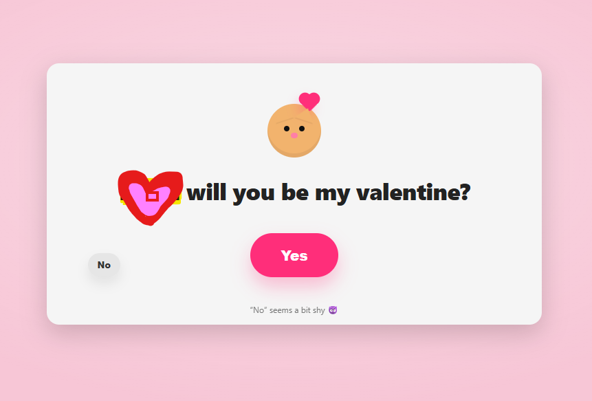
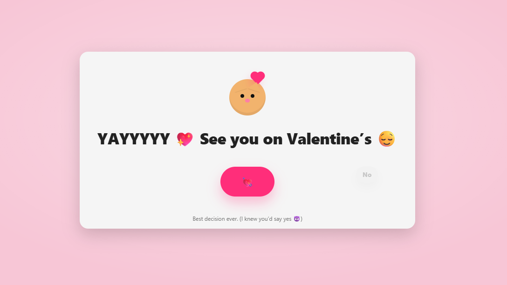

# 💘 Valentine “Yes/No” Escape Button Web App

A tiny, single-page web app built with **vanilla HTML + CSS + JavaScript** that recreates the classic Valentine prank:

- **SS-1:** The ask — “will you be my valentine?” with a big **Yes** button and a **No** button that *runs away*  
- **SS-2:** The win — after clicking **Yes**, the UI updates and **hearts burst** for a cute celebration

---

## ✅ Features (What you see)

- **Centered card UI** on a soft pink gradient background
- **Cute icon** at the top (cat + heart vibe)
- **Evasive “No” button**
  - The button stays **small** (never stretches)
  - It detects your cursor **before you reach it**
  - It “teleports” to a new safe spot inside the card
- **“Yes” celebration**
  - Clicking **Yes** triggers a **heart burst particle animation**
  - The page swaps to a **success message** (matches SS-1)
  - The “No” button becomes harmless/disabled after acceptance

---

## 🧠 How it works (Technical Overview)

### 1) Evasive “No” button logic
- The “No” button is `position: absolute` inside a bounded container (`.actions`)
- On `mousemove`, the app computes cursor distance to the button’s center:
  - If distance is below a threshold (ex: `RUN_DISTANCE = 160`), the button relocates
- On `pointerenter` or `pointerdown`, it **immediately moves again**
- New positions are **clamped** so it always stays inside the card and remains clickable-looking (but practically impossible to click)

### 2) Heart burst animation (particles)
- When “Yes” is clicked, JavaScript spawns multiple heart `
` elements
- Each heart gets random velocity vectors (`--dx`, `--dy`) and scale (`--s`)
- A CSS keyframe animation moves them upward and fades them out
- Hearts self-remove after the animation ends (no memory leaks)

### 3) UI state swap after “Yes”
- Title text changes to the SS-1 style success message
- A small success “pop” animation is applied for a satisfying effect
- “No” is disabled and faded so the moment feels final

---

## 🚀 Deploy (GitHub Pages)
This project is designed to be hosted as a simple link.

**GitHub Pages (recommended):**
1. Put your file at: `docs/index.html`
2. Go to: **Settings → Pages**
3. Source: **Deploy from a branch**
4. Branch: `main`
5. Folder: `/docs`
6. Save → share your GitHub Pages link

---

## 🖼️ Screenshots

> Add these images to your repo and update the paths below if needed.  
**Recommended location:** `docs/assets/SS-1.png` and `docs/assets/SS-2.png`

  
<strong>Initial screen — “No” runs away</strong>

   

  

  
<strong>After clicking “Yes” — success screen</strong>

   

  

---

## 🛠️ Tech Stack
- **HTML** for structure
- **CSS** for layout + animations (hearts + UI)
- **JavaScript** for:
  - cursor distance detection
  - evasive button movement
  - heart particle spawning + cleanup
  - success-state UI changes

---

## 📌 Notes
- Works on **desktop + mobile**
- No frameworks, no dependencies
- Easy to customize text/name and messages in one file

---
Made for fun. Use responsibly. 💖

---

<!-- small separator space -->
 

  
secret msg for the loml

   

  🔐 **Encrypted PDF (password required):**  
  [Download Valentines2026](pdf/download/Valentines2026.pdf?raw=1)

